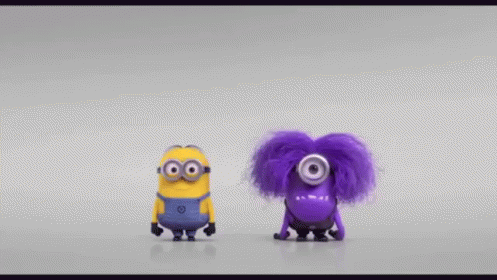

<!-- Navbar -->

    

<!-- Back arrow button -->

    

<!-- Title -->
<h1 align="center">Hello 👋, Welcome to my Study Repository.</h1>

<!-- Hello Picture -->

    

 

 Repository created to save my studies in programming languages.

## 📚 Table of Contents

🟡<a href="JavaScript/">  JavaScript</a>

🟢<a href="Projects/">  Projects</a>

##

<!-- Top arrow button -->

    

<!-- Footer -->

    

